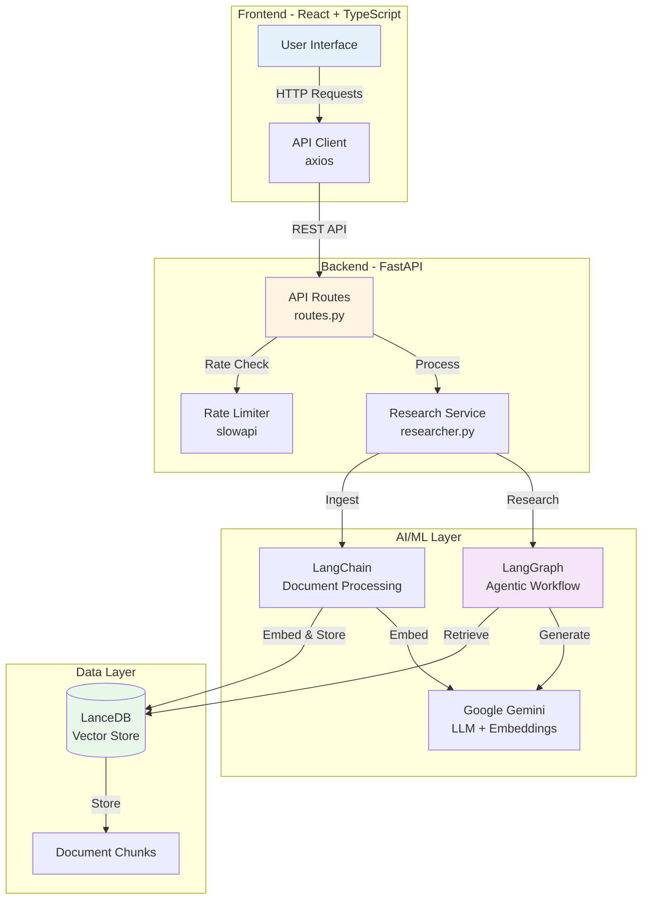
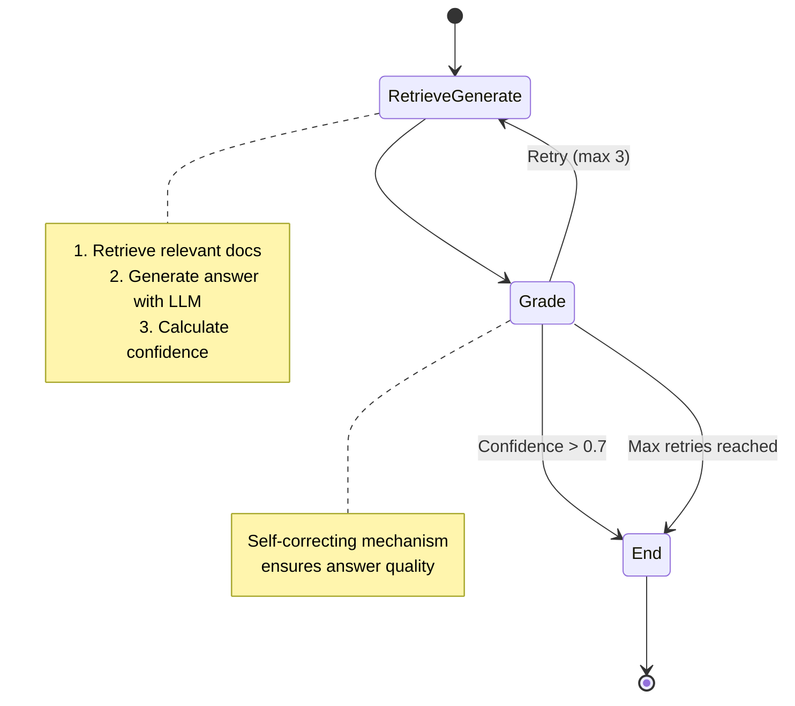

# Reliable Researcher - Production-Grade Agentic RAG Application

> **A full-stack AI research assistant that uses self-correcting agentic workflows to provide reliable, confidence-scored answers from your documents.**

[](https://www.python.org/downloads/)
[](https://fastapi.tiangolo.com/)
[](https://reactjs.org/)
[](https://www.typescriptlang.org/)
[](LICENSE)

---

## 🎯 Overview

Reliable Researcher is a production-ready AI application that combines **Retrieval-Augmented Generation (RAG)** with **agentic workflows** powered by LangGraph. It ingests content from multiple sources (URLs, PDFs, raw text), stores embeddings in a local vector database, and uses a self-correcting agent to generate high-confidence answers.

### Key Features

- ✨ **Agentic RAG Workflow**: Self-correcting retrieve-grade-generate loop using LangGraph
- 📚 **Multi-Source Ingestion**: Support for URLs, PDF uploads, and raw text
- 🎯 **Confidence Scoring**: Transparent reliability metrics for each answer
- 🗄️ **Local Vector Database**: Serverless LanceDB for efficient embedding storage
- 🚀 **Production-Ready**: Docker support, rate limiting, comprehensive error handling
- 🧪 **Tested**: Comprehensive test suite with pytest
- 🎨 **Modern UI**: Beautiful, responsive React interface with Tailwind CSS
- 🔒 **Secure**: Input validation, rate limiting, and environment-based CORS

---

## 🏗️ Architecture



### Workflow: Agentic RAG Loop



---

## 🚀 Quick Start

### Prerequisites

- **Python 3.11+**
- **Node.js 18+**
- **Google API Key** ([Get one here](https://aistudio.google.com/app/apikey))

### 1. Clone & Setup Environment

```bash
git clone <your-repo-url>
cd agentic-research-assistant

# Create .env file
cp .env.example .env
# Edit .env and add your GOOGLE_API_KEY
```

### 2. Backend Setup

```bash
cd backend

# Install dependencies
pip install -e .

# Run the server
uvicorn app.main:app --reload
```

Backend will be available at `http://localhost:8000`

### 3. Frontend Setup

```bash
cd frontend

# Install dependencies
npm install

# Run the dev server
npm run dev
```

Frontend will be available at `http://localhost:5173`

---

## 🐳 Docker Deployment

### Build & Run with Docker

```bash
# Build the image
docker build -t reliable-researcher .

# Run the container
docker run -p 8000:8000 \
  -e GOOGLE_API_KEY=your_api_key_here \
  -e ENVIRONMENT=production \
  reliable-researcher
```

### Using Docker Compose (Development)

```bash
# Start both frontend and backend
docker-compose up

# Stop
docker-compose down
```

---

## 🚂 Railway Deployment

### One-Click Deploy

1. **Push to GitHub**
   ```bash
   git add .
   git commit -m "Ready for deployment"
   git push origin main
   ```

2. **Connect to Railway**
   - Go to [Railway.app](https://railway.app)
   - Click "New Project" → "Deploy from GitHub repo"
   - Select your repository

3. **Set Environment Variables**
   ```
   GOOGLE_API_KEY=your_google_api_key
   ENVIRONMENT=production
   FRONTEND_URL=https://your-app.railway.app
   ```

4. **Deploy!**
   - Railway will automatically detect the `Dockerfile` and `railway.json`
   - Your app will be live in ~2 minutes

### Cost Estimate

- **Railway Free Tier**: $5/month credit (sufficient for portfolio use)
- **Google Gemini API**: Free tier (15 req/min, 1500 req/day)
- **Total**: $0-5/month for typical portfolio usage

---

## 📚 API Documentation

### Base URL

- **Local**: `http://localhost:8000`
- **Production**: `https://your-app.railway.app`

### Endpoints

#### Health Check
```http
GET /health
```

**Response:**
```json
{
  "status": "healthy",
  "version": "1.0.0",
  "environment": "production"
}
```

#### Ingest URL/PDF
```http
POST /api/ingest
Content-Type: application/json

{
  "source": "https://example.com/article" or "/path/to/file.pdf"
}
```

**Rate Limit**: 10 requests/minute

#### Ingest Text
```http
POST /api/ingest/text
Content-Type: application/json

{
  "text": "Your raw text content here..."
}
```

**Rate Limit**: 10 requests/minute  
**Max Size**: 100,000 characters

#### Upload PDF
```http
POST /api/ingest/file
Content-Type: multipart/form-data

file: <PDF file>
```

**Rate Limit**: 5 requests/minute  
**Max Size**: 10MB

#### Research Query
```http
POST /api/research
Content-Type: application/json

{
  "query": "What is the main topic of the documents?"
}
```

**Rate Limit**: 10 requests/minute  
**Max Length**: 1000 characters

**Response:**
```json
{
  "answer": "The main topic is...",
  "confidence_score": 0.85,
  "source_chunk_ids": ["chunk_1", "chunk_2"]
}
```

### Interactive API Docs

Visit `/docs` for Swagger UI documentation when running the backend.

---

## 🧪 Testing

### Backend Tests

```bash
cd backend

# Run all tests
pytest

# Run with coverage
pytest --cov=app --cov-report=html

# Run specific test file
pytest tests/test_api.py -v
```

### Test Coverage

- ✅ Health check endpoint
- ✅ Input validation (all endpoints)
- ✅ Rate limiting
- ✅ Error handling
- ✅ File upload validation
- ✅ Research workflow

---

## 🔧 Configuration

### Environment Variables

| Variable | Description | Default | Required |
|----------|-------------|---------|----------|
| `GOOGLE_API_KEY` | Google Gemini API key | - | ✅ Yes |
| `FRONTEND_URL` | Frontend URL for CORS | `http://localhost:5173` | No |
| `ENVIRONMENT` | Environment mode | `development` | No |

### Rate Limits

| Endpoint | Limit | Purpose |
|----------|-------|---------|
| `/health` | 30/minute | Health checks |
| `/api/ingest` | 10/minute | URL/PDF ingestion |
| `/api/ingest/text` | 10/minute | Text ingestion |
| `/api/ingest/file` | 5/minute | File uploads |
| `/api/research` | 10/minute | Research queries |

---

## 🛠️ Tech Stack

### Backend
- **FastAPI** - Modern, fast web framework
- **LangChain** - Document processing and embeddings
- **LangGraph** - Agentic workflow orchestration
- **LanceDB** - Serverless vector database
- **Google Gemini** - LLM and embeddings
- **slowapi** - Rate limiting
- **pytest** - Testing framework

### Frontend
- **React 19** - UI library
- **TypeScript** - Type safety
- **Vite** - Build tool
- **Tailwind CSS** - Styling
- **axios** - HTTP client
- **Lucide React** - Icons
- **React Markdown** - Markdown rendering

### DevOps
- **Docker** - Containerization
- **Railway** - Deployment platform
- **GitHub Actions** - CI/CD (optional)

---

## 📁 Project Structure

```
agentic-research-assistant/
├── backend/
│   ├── app/
│   │   ├── api/
│   │   │   └── routes.py          # API endpoints
│   │   ├── models/
│   │   │   └── api_models.py      # Pydantic models
│   │   ├── services/
│   │   │   └── researcher.py      # Core RAG logic
│   │   └── main.py                # FastAPI app
│   ├── tests/
│   │   └── test_api.py            # API tests
│   ├── pyproject.toml             # Python dependencies
│   └── pytest.ini                 # Pytest config
├── frontend/
│   ├── src/
│   │   ├── App.tsx                # Main component
│   │   ├── api.ts                 # API client
│   │   └── main.tsx               # Entry point
│   ├── package.json               # Node dependencies
│   └── vite.config.ts             # Vite config
├── data/
│   └── lancedb/                   # Vector database
├── Dockerfile                     # Production build
├── docker-compose.yml             # Local development
├── railway.json                   # Railway config
├── .env.example                   # Environment template
└── README.md                      # This file
```

---

## 🐛 Troubleshooting

### Common Issues

#### 1. "No module named 'app'"
```bash
# Make sure you're in the backend directory
cd backend
pip install -e .
```

#### 2. "GOOGLE_API_KEY not found"
```bash
# Create .env file in project root
echo "GOOGLE_API_KEY=your_key_here" > .env
```

#### 3. "CORS error" in frontend
```bash
# Check that FRONTEND_URL matches your frontend URL
# In .env:
FRONTEND_URL=http://localhost:5173
```

#### 4. "Rate limit exceeded"
Wait 1 minute or adjust limits in `backend/app/main.py` and `backend/app/api/routes.py`

#### 5. Docker build fails
```bash
# Clear Docker cache
docker system prune -a
docker build --no-cache -t reliable-researcher .
```

#### 6. "No answer found" error
Make sure you've ingested documents before querying:
1. Ingest a URL, PDF, or text first
2. Then ask your research question

---

## 🎯 Usage Example

### 1. Ingest Content

**Option A: URL**
```bash
curl -X POST http://localhost:8000/api/ingest \
  -H "Content-Type: application/json" \
  -d '{"source": "https://en.wikipedia.org/wiki/Artificial_intelligence"}'
```

**Option B: Text**
```bash
curl -X POST http://localhost:8000/api/ingest/text \
  -H "Content-Type: application/json" \
  -d '{"text": "Artificial intelligence is transforming industries..."}'
```

### 2. Research

```bash
curl -X POST http://localhost:8000/api/research \
  -H "Content-Type: application/json" \
  -d '{"query": "What are the main applications of AI?"}'
```

**Response:**
```json
{
  "answer": "Based on the ingested content, the main applications of AI include...",
  "confidence_score": 0.92,
  "source_chunk_ids": ["chunk_0", "chunk_3", "chunk_7"]
}
```

---

## 🤝 Contributing

Contributions are welcome! Please feel free to submit a Pull Request.

1. Fork the repository
2. Create your feature branch (`git checkout -b feature/AmazingFeature`)
3. Commit your changes (`git commit -m 'Add some AmazingFeature'`)
4. Push to the branch (`git push origin feature/AmazingFeature`)
5. Open a Pull Request

---

## 📝 License

This project is licensed under the MIT License - see the [LICENSE](LICENSE) file for details.

---

## 🙏 Acknowledgments

- **LangChain** for the amazing document processing framework
- **LangGraph** for agentic workflow capabilities
- **Google** for Gemini API
- **FastAPI** for the excellent web framework
- **Railway** for easy deployment

---

## 📧 Contact

**Your Name** - [@yourhandle](https://twitter.com/yourhandle)

Project Link: [https://github.com/yourusername/agentic-research-assistant](https://github.com/yourusername/agentic-research-assistant)

---

## 🎓 For Recruiters

This project demonstrates:

- ✅ **Full-Stack Development**: React + TypeScript frontend, FastAPI backend
- ✅ **AI/ML Integration**: LangChain, LangGraph, RAG architecture
- ✅ **Production Best Practices**: Docker, testing, rate limiting, error handling
- ✅ **Modern Tech Stack**: Latest versions of React, FastAPI, and AI frameworks
- ✅ **Clean Architecture**: Separation of concerns, modular design
- ✅ **DevOps**: Containerization, deployment configuration
- ✅ **Documentation**: Comprehensive README, API docs, code comments

**Tech Skills Highlighted:**
- Python, TypeScript, JavaScript
- FastAPI, React, Vite
- LangChain, LangGraph, Vector Databases
- Docker, Railway, CI/CD
- REST APIs, Rate Limiting, Security
- Testing (pytest), Error Handling
- Git, GitHub, Documentation

---

**Built with ❤️ by [Your Name]**
