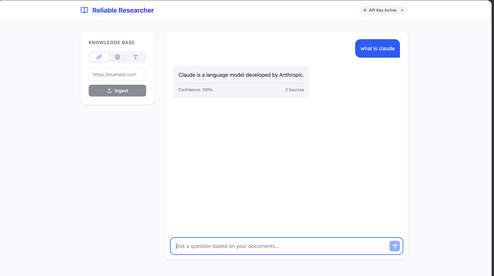
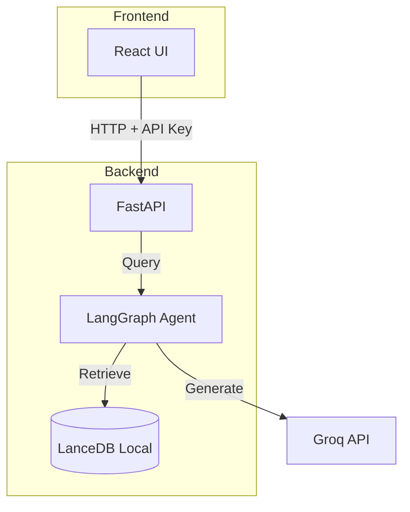

# Reliable Researcher - Local Agentic RAG

> **A local, privacy-focused AI research assistant that uses self-correcting agentic workflows to provide reliable answers from your documents.**



[](https://www.python.org/downloads/)
[](https://reactjs.org/)
[](https://www.docker.com/)

---

## 🎯 Overview

Reliable Researcher is an AI application that combines **Retrieval-Augmented Generation (RAG)** with **agentic workflows** powered by LangGraph. It ingests content from multiple sources (URLs, PDFs, raw text), stores embeddings locally, and uses a self-correcting agent to generate high-confidence answers.

### Key Features

- ✨ **Agentic RAG Workflow**: Self-correcting retrieve-grade-generate loop using LangGraph
- 📚 **Multi-Source Ingestion**: Support for URLs, PDF uploads, and raw text
- 🎯 **Confidence Scoring**: Transparent reliability metrics for each answer
- 🗄️ **Local Vector Database**: Serverless LanceDB for efficient embedding storage (Local)
- 🔒 **Privacy Focused**: Your data stays local. API Keys are stored in your browser.
- 🐳 **Easy Setup**: Single command startup with Docker Compose.

### Gallery
| | |
|:-------------------------:|:-------------------------:|
|  |  |
|  | |

---

## 🚀 Quick Start

### Prerequisites

- **Docker Desktop** installed and running.
- **Groq API Key** ([Get one here](https://console.groq.com/keys)) for the LLM.

### Run the Application

1. **Clone & Build**
   ```bash
   git clone <your-repo-url>
   cd agentic-research-assistant
   
   # Build and start the services
   docker-compose up --build
   ```

2. **Access the App**
   - Open your browser to **[http://localhost:5173](http://localhost:5173)**.
   - You will be prompted to enter your **Groq API Key** on startup.
   - The key is stored locally in your browser and used for research queries.

3. **Stop the App**
   ```bash
   docker-compose down
   ```

---

## 🏗️ Architecture



## 🛠️ Tech Stack

- **Backend**: FastAPI, LangGraph, LanceDB, LangChain
- **Frontend**: React, TypeScript, Tailwind CSS, Lucide Icons
- **Infrastructure**: Docker Compose

## 📝 License

This project is licensed under the MIT License - see the [LICENSE](LICENSE) file for details.

---
